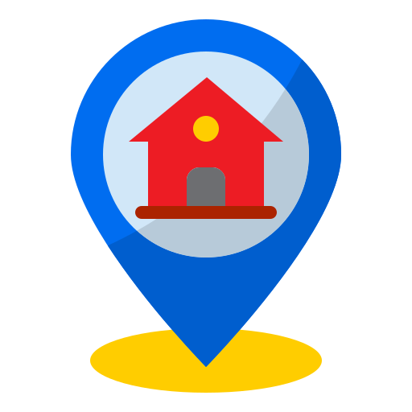

[<< Back](../README.md)

# GeoJSON Point

1. Setelah menambahkan library jQuery, tambahkan script berikut ini untuk membuat GeoJSON Point pada peta.

```javascript
// GeoJSON Point Sarana Prasarana
var sarana_prasarana = L.geoJSON(null, {
	// Style

	// onEachFeature

});
```

2. Tambahkan script untuk memanggil data GeoJSON file menggunakan jQuery.

```javascript
$.getJSON("data/sarana_prasarana.geojson", function (data) {
	sarana_prasarana.addData(data); // Menambahkan data ke dalam GeoJSON Point Sarana Prasarana
	map.addLayer(sarana_prasarana); // Menambahkan GeoJSON Point Sarana Prasarana ke dalam peta
});
```

3. Tambahkan script untuk mengatur style pada GeoJSON Point menjadi custom icon ke dalam L.geoJSON.

```javascript
pointToLayer: function (feature, latlng) {
	return L.marker(latlng, {
		icon: L.icon({
			iconUrl: "icon/home_marker.png", // icon marker
			iconSize: [48, 48], // ukuran icon
			iconAnchor: [24, 48], // posisi icon terhadap titik (point)
			popupAnchor: [0, -48], // posisi popup terhadap icon
			tooltipAnchor: [-16, -30], // posisi tooltip terhadap icon
		}),
	});
},
```

[Download icon](../icon/home_marker.png)




4. Tambahkan script untuk menampilkan Tooltip pada GeoJSON Point ketika *layer on* dan pada *event mouseover*. Sesuaikan feature.properties dengan data GeoJSON file yang digunakan.

```javascript
onEachFeature: function (feature, layer) {
	// variable popup content
	var popup_content = "Nama: " + feature.properties.nama + "<br>" +
		"Koordinat: " + feature.geometry.coordinates[1] + ", " + feature.geometry.coordinates[0];

	layer.on({
		click: function (e) {
			sarana_prasarana.bindPopup(popup_content);
		},
	});
},
```

5. Tambahkan script berikut ini untuk menambahkan tooltip ketika cursor berada di atas GeoJSON Polyline. Letakkan di dalam layer.on.

```javascript
mouseover: function (e) {
	sarana_prasarana.bindTooltip(feature.prperties.nama, {
		direction: "left",
		sticky: true,
	});
},
```

Reference: [https://leafletjs.com/examples/geojson/](https://leafletjs.com/examples/geojson/)

---

> [unsorry@2024](https://unsorry.net)
