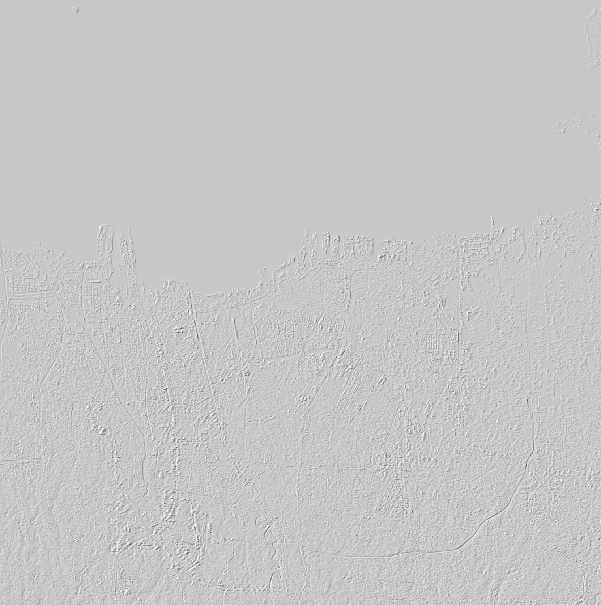

[<< Back](../README.md)

# Image Overlay

1. Download data hillshade jakarta sebagai contoh [disini](../data/hillshade_jakarta.png)



2. Letakkan file `hillshade_jakarta.png` pada folder `data` pada direktori project Anda.

3. Tambahkan script berikut ini untuk menambahkan image overlay pada peta.
```javascript
// Image Overlay
var imageUrl = 'data/hillshade_jakarta.png';
var imageExtent = [[-6.25,106.75], [-6.0,107.0]];
var imageOverlay = L.imageOverlay(imageUrl, imageExtent);

// Menambahkan image overlay ke dalam peta
imageOverlay.addTo(map);
```
Reference: [https://leafletjs.com/reference.html#control-scale](https://leafletjs.com/reference.html#control-scale)

---
> [unsorry@2024](https://unsorry.net)